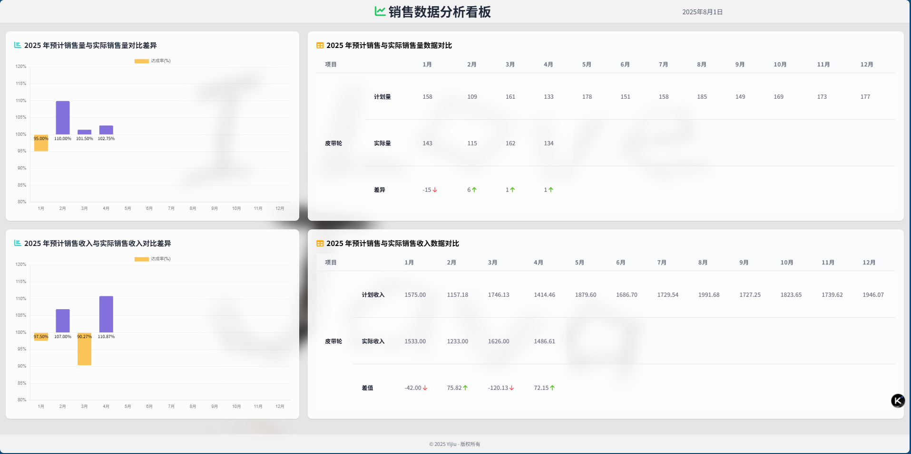

SPDX-License-Identifier: MIT

# React_Vite_sales-display

## 📖 写在最前面
> 该项目基于 jsx 开发，使用 vite 及 react 框架，公司信息，logo等已替换。
> 该项目未开发完全，仅为前端 UI 及模拟数据展示，暂时不包含后端 flask 数据处理与更新逻辑

---

## ⚙️ 介绍
> 一个基于 react 框架的前端 web 看板应用，用于展示公司销售数据，配合后端 flask 程序使用。

---

## 📌 主要功能
- ✅ 功能 1：基于 Excel 中的数据，展示销售部门数据看板

---

## 🆕 最近更新
| 日期 | 版本 | 变更摘要 |
|------|------|----------|
| 2025-07-28 | v1.1.0 | 修改替换敏感内容 |

---

## 🛠️ 技术栈
- React
- Vite
- jsx

---

## 🚀 快速开始
1. 克隆仓库  
   ```bash
   git clone https://github.com/yijiu2333/React_Vite_sales-display.git
   cd React_Vite_sales-display

   ```

3. 本地启动
   ```bash
   npm run dev

   ```
   或
   ```bash
   npm run build

   ```
   在服务器部署 dist 文件

4. 打开浏览器访问
    http://127.0.0.1:3000/ （默认端口）

---

## 🖼️ 程序总览
   

---

## 🚫 版权说明
   - 本项目仅供学习/作品集展示，请勿用于任何商业用途。
   - 文件中均为虚拟数据，仅用于程序功能展示，纯属虚构，不代表真实情况。

---

## 📄 许可证
   - [MIT](./LICENSE) © 2025 Yijiu233